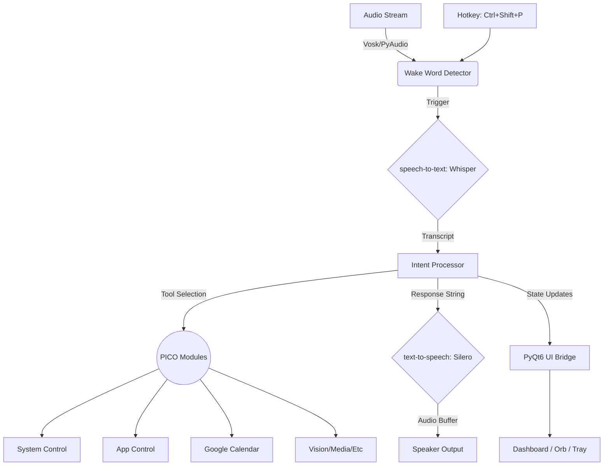

## Overview

**PICO** is a production-grade, local-first voice assistant designed specifically for the Windows operating system. It leaps past basic chatbots by natively integrating deep system controls through tools like `nircmd` and Windows COM, alongside high-fidelity audio processing via **Vosk** (wake word), **Whisper** (transcription), and **Silero** (text-to-speech).

PICO is powered by an LLM-based intent engine that can leverage either robust cloud providers (like **OpenRouter**) or completely offline, local models (via **Ollama**). Its modular architecture allows it to easily control your apps, read your screen with vision models, manage your calendar, and completely control your system environment.

---

## Key Features

### Core Intelligence

- **Offline Wake Word**: Always-listening wake word detection ("Hey PICO") powered by a local lightweight Vosk model.
- **High-Fidelity STT & TTS**: Uses OpenAI's Whisper for robust Speech-to-Text and Silero for natural, fluid Text-to-Speech playback.
- **Dual LLM Engines**: Swap between leading cloud models (e.g., Llama 3.1 via OpenRouter) or local execution (Ollama) instantly.
- **Vision Capabilities**: Context-aware screen analysis using vision models natively (Gemini, Claude, or Moondream).

### Rich UI/UX Native Overlays

- **Floating Orb**: A stylish PyQt6 responsive orb indicating the assistant's state.
- **Transcript Overlay**: Subtitle-like transient text overlays showing what PICO heard and its response.
- **System Tray Integration**: Quietly runs in the background with zero desktop clutter.

### Extendable Modules

| Module             | Description                 | capabilities                                                                                     |
| ------------------ | --------------------------- | ------------------------------------------------------------------------------------------------ |
| **System Control** | Deep OS integration         | Volume, brightness, battery, locking, power management via `nircmd` and `pycaw`.                 |
| **App Control**    | Windows application manager | Open, close, search, type text, or simulate keyboard shortcuts via `psutil` and `pyautogui`.     |
| **Calendar**       | Google Calendar integration | Read and manage daily agendas seamlessly via OAuth.                                              |
| **Music**          | Universal Audio             | Background music streaming utilizing YouTube Music via `ytmusicapi`, `yt-dlp`, and VLC playback. |
| **Messaging**      | Cross-Platform Comms        | Send messages instantly using Telegram and WhatsApp (`pywhatkit`).                               |
| **Reminders**      | Background Scheduling       | Intelligent background alarms and routine management using `schedule`.                           |
| **Screen Vision**  | Visual Context              | Snapshots user screen and parses context using advanced vision LLMs.                             |
| **Web Browser**    | Online fetching             | Instant web queries and web-app initialization.                                                  |

---

## 🏗 System Architecture

The project runs on a dual-thread architecture to ensure the UI remains buttery smooth while complex AI tasks run in the background.



---


### Interacting with PICO

1. **Wake Word**: Say _"Hey PICO"_ (if enabled in config).
2. **Hotkey**: Press `Ctrl + Shift + P` globally from any application.
3. Wait for the audio cue and the **Orb** to glow, then speak your command.
   - _"Turn down the brightness to 50%."_
   - _"Play some jazz music."_
   - _"Open Visual Studio Code."_
   - _"What's on my screen right now?"_

---

## Project Structure

```text
PICO_V1/
├── assets/          # TTS ONNX models and static visual assets
├── bin/             # External binaries (nircmd.exe)
├── core/            # The brain of PICO
│   ├── config.py       # Pydantic configuration loader
│   ├── intent.py       # LLM intent digestion and tool selection
│   ├── state_manager.py# UI and Voice state transitions
│   ├── stt.py          # Whisper transcription engine
│   ├── tts.py          # Silero voice stream integration
│   └── wake_word.py    # Vosk hot-mic threaded listener
├── data/            # Local JSON memory and calendar tokens
├── logs/            # Rotating application logs
├── models/          # Offline AI models (Vosk)
├── modules/         # Actionable agentic sub-systems
│   ├── app_control.py      # Psutil/Pyautogui app management
│   ├── calendar_integration.py # Google Calendar OAuth & parsing
│   ├── system_control.py   # Windows volume/brightness via COM/NirCmd
│   └── screen_vision.py    # Pillow/Vision LLM screen processing
├── ui/              # PyQt6 Front-end Elements
│   ├── dashboard.py    # Main GUI panel
│   ├── orb.py          # Floating voice status indicator
│   └── overlay.py      # Transient subtitles
└── main.py          # Application thread and bridge initialization
```

---

## Development

### Adding a new Module

PICO is built to scale. To add new functionalities:

1. Create a Python file in `modules/` (e.g., `smart_home.py`).
2. Add a uniform `handle(action: str, params: dict) -> str` function.
3. Update the LLM System Prompt in `core/config.py` or the specific router logic in `core/intent.py` to make PICO aware of the tool.

### Modifying the UI

The GUI is isolated from the core blocking thread via `UIBridge(QObject)`. All PyQt elements emit and receive transitions bounded by the global `PicoState` enumerator.

---

## Troubleshooting

- **`nircmd` not recognized**: Ensure `nircmd.exe` is safely unpacked in the `bin/` directory or your Windows `PATH` environment variable.
- **Audio failures (VLC)**: Ensure the 64-bit version of VLC Media Player is installed on your OS.
- **ModuleNotFoundError: No module named 'win32com'**: Ensure you are on Windows. PICO leverages `pywin32` implicitly via combinations of pycaw and pythonnet. Install `pywin32` manually if it fails.
- **Missing Vosk Model Array Error**: Make sure you have downloaded the Vosk model and placed it in the `models/vosk-model-small-en-in-0.4/` directory precisely.

---


## Acknowledgments

PICO rests on the shoulders of incredible open-source tools:

- [Vosk](https://alphacephei.com/vosk/) for lightning-fast offline wake words.
- [OpenAI Whisper](https://github.com/openai/whisper) for state-of-the-art ASR.
- [Silero TTS](https://github.com/snakers4/silero-models) for incredible voice quality.
- [NirSoft](http://www.nirsoft.net/) for the legendary NirCmd utility.
- [PyQt](https://riverbankcomputing.com/software/pyqt/) for robust native UI building.
